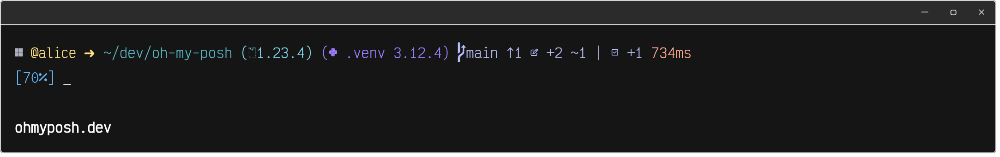

# Oh My Posh Themes

A small personal collection of [Oh My Posh](https://ohmyposh.dev/) themes.

## Preview



## Collection

| Theme    | Configuration                                   | Preview                           | Includes                                                            |
| -------- | ----------------------------------------------- | --------------------------------- | ------------------------------------------------------------------- |
| One More | [`one-more.omp.json`](config/one-more.omp.json) | [View image](assets/one-more.png) | OS, user, path, Go, Python, Git, execution time, and battery status |

Theme configurations are stored in [`config/`](config/), and screenshots and other visual assets are stored in [`assets/`](assets/).

## Usage

Install [Oh My Posh](https://ohmyposh.dev/docs/installation/linux) and use a [Nerd Font](https://www.nerdfonts.com/) for the icons.

From this directory, initialize the theme for your shell:

### PowerShell

```powershell
oh-my-posh init pwsh --config ./config/one-more.omp.json | Invoke-Expression
```

### Bash

```bash
eval "$(oh-my-posh init bash --config ./config/one-more.omp.json)"
```

### Zsh

```zsh
eval "$(oh-my-posh init zsh --config ./config/one-more.omp.json)"
```

To make the theme permanent, add the matching command to your shell profile.
